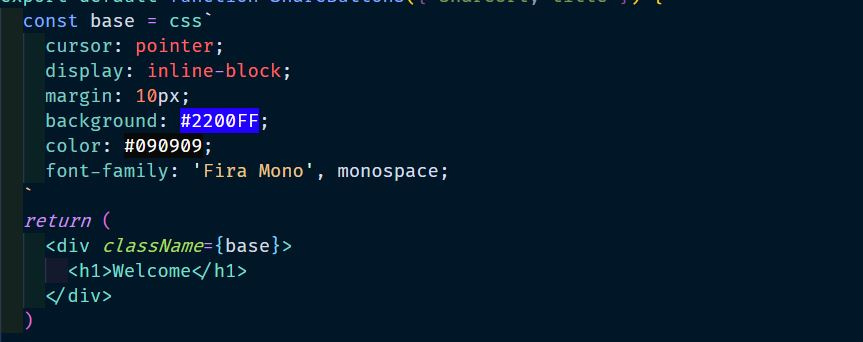

I've looked at CSS in JS libraries before but there always seemed be trade-offs which have made them appear less attractive than Sass or even plain CSS. However, I have recently been playing around with [Emotion](https://github.com/emotion-js/emotion) and I'm pretty impressed! I want to show some examples of what I have been doing with it and hopefully convince my team that it is time to move away from Sass.

I've been using Emotion with React, there is a React-specific package (_@emotion/core_) which provides some additional features but I have just been using their framework agnostic version. There are also several different ways that you can use Emotion, the examples below use the method that works best for me, check out their [documentation](https://emotion.sh/docs/introduction) if you're interested in what else it can do.

Emotion uses [tagged templates](https://developer.mozilla.org/en-US/docs/Web/JavaScript/Reference/Template_literals#Tagged_templates) to create a CSS class which is then applied to the element. Here is the basic pattern for applying styles to a React component:
```jsx
import React from 'react'
import { css } from 'emotion'

export default function TestComponent(props) {
  return (
    <div
      className={css`
        background: blue;
        border: 1px solid red;
        max-width: 300px;
      `}
    >
      Hello
    </div>
  )
}
```
Notice that the string passed to the tagged template is actual CSS, there are no camel-cased keys, the values do not need to be wrapped in single quotes and the lines are terminated with semi-colons. At first I was disappointed because the syntax highlighting in VS Code was messed up but I added the [Babel Javascript](https://marketplace.visualstudio.com/items?itemName=mgmcdermott.vscode-language-babel) extension which formats the CSS as if it were in a _.css_ file so now it looks nice. :+1:



If you look at the markup you can see that Emotion assigns a class to the elements with a random string appended to it.


This scopes your CSS so it won't leak to other components, making your styling component-based as opposed to document-based which fits better with the way that React apps are written. If you want to set global styles then Emotion has a [Global component](https://emotion.sh/docs/globals) you can use, and there is nothing stopping you from using a global stylesheet in addition to your component level styles.

I started writing my styles straight into the JSX but things began to look messy. Fortunately it's really easy to extract the rules and move them above the JSX or even into their own file:
```jsx
import React from 'react'
import { css } from 'emotion'

export default function TestComponent(props) {
  const styling = css`
    background: blue;
    border: 1px solid red;
    max-width: 300px;
  `
  return (
    <div
      className={styling}
    >
      Hello
    </div>
  )
}
```
It's possible to do nested components, pseudo-classes and media queries:
```jsx
const styling = css`
  background: blue;
  border: 1px solid red;
  max-width: 300px;

  a {
    color: black;
  }
  &:hover {
    background: pink;
  }
  @media (max-width: 400px) {
    font-size: 12px;
  }
`
```

If you check the Emotion documentation there are some pretty clever things you can do with media queries if you have a lot of breakpoints to cater for, I won't go into it here but [take a look](https://emotion.sh/docs/media-queries) if you're interested.

Because these are just strings you can do interpolation:
```jsx
const baseStyle = css`
  width: 300px;
  border: 1px solid black;
`
const green = css`
  ${baseStyle}
  background: green;
  `
const blue = css`
  ${baseStyle}
  background: blue;
`
const red = css`
  ${baseStyle}
  background: red;
`
return (
  <>
    <div className={green}>Green</div>
    <div className={blue}>Blue</div>
    <div className={red}>Red</div>
  </>
)
```

You could take this further and use functions:
```jsx
const baseStyle = css`
  width: 300px;
  border: 1px solid black;
`
function styles(color) {
  return css`
    ${baseStyle}
    background: ${color};
  `
}

return (
  <>
    <div className={styles('green')}>Green</div>
    <div className={styles('blue')}>Blue</div>
    <div className={styles('red')}>Red</div>
  </>
)
```
And it's not just values, any part of the string can be interpolated:
```jsx
const smallScreen = '@media (max-width: 400px)'

const style = css`
  ${smallScreen} {
    font-size: 12px;
  }
`
```

I've only been using Emotion for a very brief time but transitioning to it has been extremely easy because it offers all of the functionality of CSS but with the flexibility of JavaScript. The compositional way in which Emotion allows you to build your CSS compliments React nicely, particularly now that hooks are live. This is particularly noticeable when you reach a point where you want to extract some logic into its own component; simply cut and paste the JSX, hooks and styling out of your component and paste them into a new file.