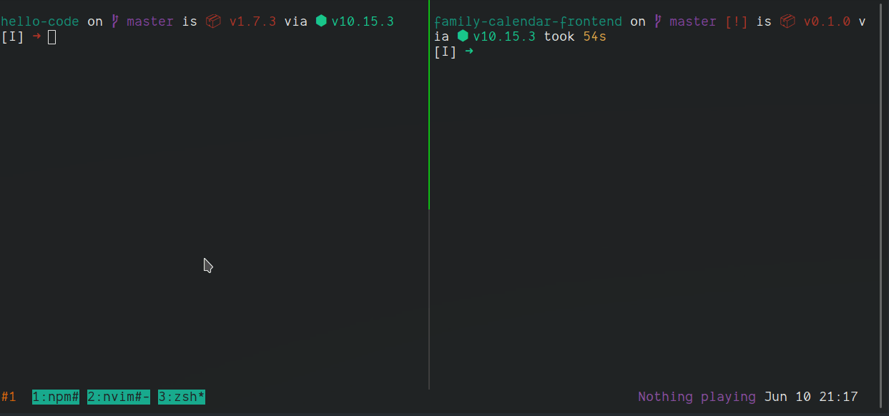

In my team at work we currently have five apps which have been written in React. These apps were all sharing components held in a single repository. As the number of apps and components is increasing, we decided it would be a better idea to separate our shared components into their own respositories. This has been a big task as, not only did our apps need to be updated to import the components from their new locations, but a lot of the components depend on other components meaning that every split led to more places where changes needed to be made.

There have been two tools which have helped me complete this task which I am going to introduce you to now (if you haven't used them already); Tmux and Codemod.

## Codemod

[Codemod](https://github.com/facebook/codemod) is a command line tool written by Facebook. You give it a Regex pattern to search for and the code you want to replace it with and it will recursively search through your directories looking for every line that contains some text which matches your pattern. When it matches a line, it shows you a diff which you can either accept, decline or alter manually:


There are a load of options you can give it and you can do all sorts of clever stuff with Regex, such as capturing part of the pattern to use in the replacement; I only needed to do something very simple for this task though, here's an example using this blog's codebase:
```
codemod -d src --extensions js,jsx \
"components/blog" \
"blog-components/preview"
```

The first line tells Codemod to search recursively through all the directories in `src` with the `-d` switch. Then the `extensions` option tells Codemod to search only through `js` or `jsx` files. The second line is the pattern we are searching for which we wish to replace. You can use Regex here; I'm not very good with Regex so I use a system of trial and error using sites like [this](https://regex101.co!/)! One thing to keep in mind is that Codemod is written in Python so you want to ensure that you are using the Python 'flavour' of Regex. The final line is the text which we want to replace our matched string with.

## Tmux

[Tmux](https://github.com/tmux/tmux) is a 'Terminal Multiplexer' which is a fancy way of saying that it lets you open many terminals. I could write quite a long blog post about Tmux (and I may yet do that), so I'm just going to quickly list the main reasons you may want to use it:

* Tmux creates sessions which can be detached from and then reattached to at a later date. This is great if you are working on a remote server or having to switch contexts frequently. You can have an environment set up with different things running, detach from it when you need to and then reattach later with everything how you left it. You can also easily switch from one session to another.
* Each session can have multiple windows and each window can be split into multiple panes.
* It gives you superpowers when used with ZSH and Vim.

The reason I have included Tmux in this post though is because it allows you to synchronize panes. This means I can do things like open as many panes as there are apps in a single window and run commands in all of those panes at the same time.

So I can run `npm install` in all five apps, or commit and tag twelve component repos or, because I use Neovim as well, I can even do things like edit multiple `package.json` files in the time it would take me to edit one.



---

I shouldn't imagine there are many clients or companies which enjoy setting aside valuable time for refactoring tasks which result in no immediately visible benefit. Thanks to these tools, the task of moving our repos took a lot less time than it otherwise would have, meaning we can now get on with the important work of writing code! If you haven't heard of either of these tools then I hope this post has proved useful as an introduction. I've been using Tmux for a while now and have lovingly been crafting my config file for it which you can find on my [Github](https://github.com/mthorning/dotfiles) page if you're interested.

Goodbye :wave:
