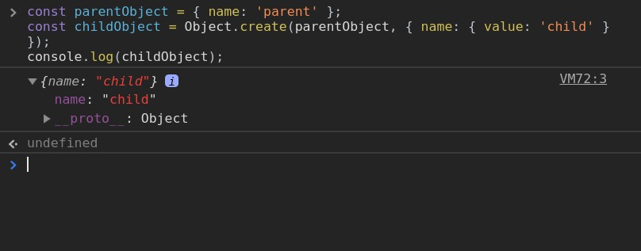
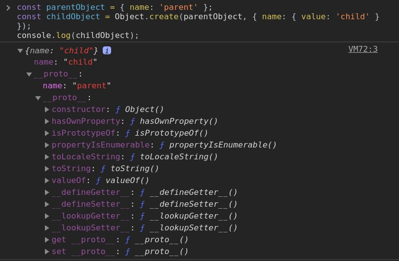

With the release of React Hooks I have seen a lot of posts comparing class components to functional components. Functional components are nothing new in React, however it was not possible before version 16.8.0 to create a stateful component with access to lifecycle hooks using only a function. Or was it?

Call me a pedant (many people already do!) but when we talk about class components we are technically talking about components created by functions. In this post I would like to use React to demonstrate what is actually happening when we write a class in JavaScript.

## Classes vs Functions

First, I would like to very briefly show how, what are commonly referred to as functional and class components, relate to one another. Here's a simple component written as a class:
```js
class Hello extends React.Component {
  render() {
    return <p>Hello!</p>
  }
}
```
And here it is written as a function:
```js
function Hello() {
  return <p>Hello!</p>
}
```
Notice that the Functional component is just a render method. Because of this, these components were never able to hold their own state or perform any side effects at points during their lifecycle. Since React 16.8.0 it has been possible to create stateful functional components thanks to hooks, meaning that we can turn a component like this:
```js
class Hello extends React.Component {
  
  state = {
    sayHello: false
  }

  componentDidMount = () => {
    fetch('greet')
      .then(response => response.json())
      .then(data => this.setState({ sayHello: data.sayHello });
  }

  render = () => {
    const { sayHello } = this.state;
    const { name } = this.props;

    return sayHello ? <p>{`Hello ${name}!`}</p> : null;
  }
}
```
Into a functional component like this:
```js
function Hello({ name }) {

  const [sayHello, setSayHello] = useState(false);

  useEffect(() => {
    fetch('greet')
      .then(response => response.json())
      .then(data => setSayHello(data.sayHello));
  }, []);

  return sayHello ? <p>{`Hello ${name}!`}</p> : null;
}
```
The purpose of this article isn't to get into arguing that one is better than the other, there are hundreds of posts on that topic already! The reason for showing the two components above is so that we can be clear about what React actually does with them.

In the case of the class component, React creates an instance of the class using the `new` keyword:
```js
const instance = new Component(props);
```
This instance is an object; when we say a component is a class, what we actually mean is that it is an object. This new object component can have its own state and methods, some of which can be lifecycle methods (render, componentDidMount, etc.) which React will call at the appropriate points during the app's lifetime.

With a functional component, React just calls it like an ordinary function (because it is an ordinary function!) and it returns either HTML or more React components. Methods with which to handle component state and trigger effects at points during the component's lifecycle now need to be imported if they are required. These work entirely based on the order in which they are called by each component which uses them, they do not know which component has called them; this is why you can only call hooks at the top level of the component and they can't be called conditionally.

## The Constructor Function
JavaScript doesn't have classes. I know it looks like it has classes, we've just written two! But under the hood JavaScript is not a class-based language, it is prototype-based. Classes were added with the ECMAScript 2015 specification (also referred to as ES6) and are just a cleaner syntax for existing functionality.

Let's have a go at rewriting a React class component without using the class syntax. Here is the component which we are going to recreate:
```js
class Counter extends React.Component {

  constructor(props) {
    super(props);
    this.state = {
      count: 0
    }
    this.handleClick = this.handleClick.bind(this);
  }
  
  handleClick() {
    const { count } = this.state;
    this.setState({ count: count + 1 });
  }

  render() {
    const { count } = this.state;
    return (
      <>
        <button onClick={this.handleClick}>+1</button>
        <p>{count}</p>
      </>
    );
  }

}
```
This renders a button which increments a counter when clicked, it's a classic! The first thing we need to create is the constructor function, this will perform the same actions that the `constructor` method in our class performs apart from the call to `super` because that's a class-only thing.
```js
function Counter(props) {
  this.state = {
    count: 0
  }
  this.handleClick = this.handleClick.bind(this);
}
```
This is the function which React will call with the `new` keyword. When a function is called with `new` it is treated as a constructor function; a new object is created, the `this` variable is pointed to it and the function is executed with the new object being used wherever `this` is mentioned. 

Next, we need to find a home for the `render` and `handleClick` methods and for that we need to talk about the prototype chain.

## The Prototype Chain

JavaScript allows inheritance of properties and methods between objects through something known as the prototype chain. Well, I say inheritence, but I actually mean delegation. Unlike in other languages with classes, where properties are copied from a class to its instances, JavaScript objects have an internal protoype link which points to another object. When you call a method or attempt to access a property on an object, JavaScript first checks for the property on the object itself, if it can't find it there then it checks the object's prototype (the link to the other object), if it still can't find it then it checks the prototype's prototype and so on up the chain until it either finds it or runs out of prototypes to check.

Generally, all objects in JavaScript have `Object` at the top of their prototype chain; this is how you have access to methods such as `toString` and `hasOwnProperty` on all objects. The chain ends when an object is reached with `null` as its prototype, this is normally at `Object`.

Let's try to make things clearer with an example.

```js
const parentObject = { name: 'parent' };
const childObject = Object.create(parentObject, { name: { value: 'child' } });
console.log(childObject);
```
First we create `parentObject`. Because we've used the object literal syntax this object will be linked to `Object`. Next we use `Object.create` to create a new object using `parentObject` as its prototype. 

Now, when we use `console.log` to print our `childObject` we should see:



The object has two properties, there is the `name` property which we just set and the `__proto___` property. `__proto__` isn't an actual property like `name`, it is  an accessor property to the internal prototype of the object. We can expand these to see our prototype chain:



The first `__proto___` contains the contents of `parentObject` which has its own `__proto___` containing the contents of `Object`. These are all of the properties and methods that are available to `childObject`.

It can be quite confusing that the prototypes are found on a property called `__proto__`! It's important to realise that `__proto__` is only a reference to the linked object. If you use `Object.create` like we have above, the linked object can be anything you choose, if you use the `new` keyword to call a constructor function then this linking happens automatically to the constructor function's `prototype` property.

Ok, back to our component. Since React calls our function with the `new` keyword, we now know that to make the methods available in our component's prototype chain we just need to add them to the `prototype` property of the constructor function, like this:

```js
Counter.prototype.render = function() {
  const { count } = this.state;
  return (
    <>
      <button onClick={this.handleClick}>+1</button>
      <p>{count}</p>
    </>
  );
},

Counter.prototype.handleClick = function () {
  const { count } = this.state;
  this.setState({ count: count + 1 });
}
```

## Static Methods

This seems like a good time to mention static methods. Sometimes you might want to create a function which performs some action that pertains to the instances you are creating but it doesn't really make sense for the function to be available on each object's `this`. When used with classes they are called Static Methods, I'm not sure if they have a name when not used with classes! We haven't used any static methods in our example but React does have a few static lifecycle methods and we did use one earlier with `Object.create`. It's easy to declare a static method on a class, you just need to prefix the method with the `static` keyword:
```js
class Example {
  static staticMethod() {
    console.log('this is a static method');
  }
}
```
And it's equally easy to add one to a constructor function:
```js
function Example() {}
Example.staticMethod = function() { 
  console.log('this is a static method');
}
```
In both cases you call the function like this:
```js
Example.staticMethod()
```

## Extending React.Component

Our component is almost ready, there are just two problems left to fix. The first problem is that React needs to be able to work out whether our function is a constructor function or just a regular function because it needs to know whether to call it with the `new` keyword or not. Dan Abramov wrote a great blog post [about this](https://overreacted.io/how-does-react-tell-a-class-from-a-function/), but to cut a long story short, React looks for a property on the component called `isReactComponent`. We could get around this by adding `isReactComponent: {}` to `Counter.prototype` (I know, you would expect it to be a boolean but `isReactComponent`'s value is an empty object, you'll have to read his article if you want to know why!) but that would only be cheating the system and it wouldn't solve problem number two.

In the `handleClick` method we make a call to `this.setState`. This method is not on our component, it is "inherited" from `React.Component` along with `isReactComponent`. If you remember the [prototype chain section](#the-prototype-chain) from earlier, we want our component instance to first inherit the methods on `Counter.prototype` and then the methods from `React.Component`. This means that we want to link the properties on `React.Component.prototype` to `Counter.prototype.__proto__`. Fortunately there's a method on `Object` which can help us with this:
```js
Object.setPrototypeOf(Counter.prototype, React.Component.prototype);

```

## It Works!
That's everything we need to do to get this component working with React without using the class syntax. Here's the code for the component in one place if you would like to copy it and try it out for yourself:
```js
function Counter(props) {
  this.state = {
    count: 0
  };
  this.handleClick = this.handleClick.bind(this);
}

Counter.prototype.render = function() {
  const { count } = this.state;
  return (
    <>
      <button onClick={this.handleClick}>+1</button>
      <p>{count}</p>
    </>
  );
}

Counter.prototype.handleClick = function() {
  const { count } = this.state;
  this.setState({ count: count + 1 });
}

Object.setPrototypeOf(Counter.prototype, React.Component.prototype);
```
As you can see, it's not as nice to look at as before! In addtion to making JavaScript more accessible to developers who are used to working with traditional class-based languages, the class syntax also makes the code a lot more readable. I'm not suggesting that you should start writing your React components in this way (in fact, I would actively discourage it!), I only thought it would be an interesting exercise which would provide some insight into how JavaScript inheritence works.

---

Although you don't need to understand this stuff to write React components, it certainly can't hurt and I expect there will be occassions when you are fixing a tricky bug where understanding how prototypal inheritence works will make all the difference. I hope you have found this article interesting and/or enjoyable, if you have any thoughts on the subject then please let me know. :smiley:
